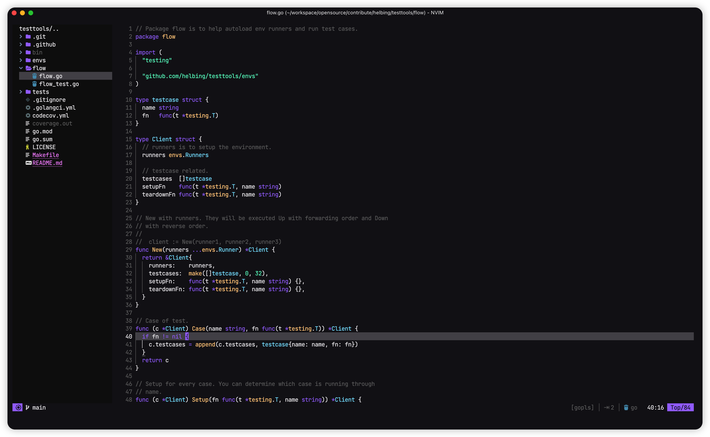

## What changes this fork offer?
- convert deprecated **nvim-treesitter** highlights to new ones
- some small changes to **nvim-treesitter** highlight colors
- better terminal colors that are more closer to original *aura* color scheme
- add option to disable overriding terminal colors
- support **indent-blankline** plugin

<h1 align="center" >aura.nvim</h1>

<p align="center"><a href="https://github.com/daltonmenezes/aura-theme">Aura</a> colorscheme for <a href="https://neovim.io/">Neovim</a> written in Lua</p>



## Requirements

- Neovim >= 0.7.0
- Treesitter (optional)
## Supported Plugins

- [TreeSitter](https://github.com/nvim-treesitter/nvim-treesitter)
- [LSPDiagnostics](https://neovim.io/doc/user/lsp.html)
- [NvimTree](https://github.com/kyazdani42/nvim-tree.lua)
- [Telescope](https://github.com/nvim-telescope/telescope.nvim)
- [Lualine](https://github.com/hoob3rt/lualine.nvim)
- [GitSigns](https://github.com/lewis6991/gitsigns.nvim)
- [DiffView](https://github.com/sindrets/diffview.nvim)

## Installation

```
-- Using Packer
use 'helbing/aura.nvim'
```
